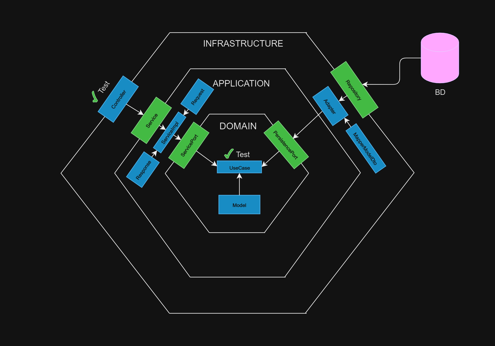

#  💻 ARCHETYPE SPRINGBOOT 💻

## 📚 Descripción

Este proyecto es un arquetipo que sigue un objetivo específico.
Es una estructura organizada para facilitar el desarrollo de aplicaciones Spring Boot. Se usa una arquitecura
hexagonal que implementa slicing vertical enfocado a microservicios.
La estructura del proyecto está diseñada para separar claramente los diferentes
capas de la aplicación y promover buenas prácticas.

## 🚀 Como usar este arquetipo

1. Instala Java SE Development Kit 11.0.19. [Downloader](https://www.oracle.com/co/java/technologies/javase/jdk11-archive-downloads.html#license-lightbox)
2. Clona este repositorio: `git clone https://github.com/pragma/webflux-archetype.git`
3. Ejecute algunas [tareas del ciclo de vida de Gradle](https://docs.gradle.org/current/userguide/java_plugin.html#lifecycle_tasks) en orden para verificar que todo este OK:
    1. Cree [el JAR del proyecto](https://docs.gradle.org/current/userguide/java_plugin.html#sec:jar) y otros artefactos del proyecto:
       `./gradlew assemble --warning-mode all`
    2. Ejecute las tareas de verificación de pruebas y complementos:
       `./gradlew check --warning-mode all`
    3. Ejecute el punto de entrada de la aplicacion principal:
       `./gradlew build`
4. ¡Empieza el desarrollo!

## 📁 Estructura del proyecto

El esqueleto utiliza la siguiente estructura de carpetas::

**module**
- **application**: Capa de aplicación para DTO controladores.
    - **dtos**: Definición de peticiones(requests) y respuestas(responses).
        - **requests**: Formatos de recepción de información que el controlador recibirá.
        - **responses**: Formato de respuesta que se mostrará como respuesta del controlador.
    - **servicehandler**: Controladores y manipuladores de peticiones.
    - **dtomapper**: Mapeadores para convertir entre objetos de dominio y DTOs.
    - **exception**: Generar y manejar excepciones para el controlador.

- **domain**: Lógica de dominio y entidades comerciales.
    - **exceptions**: Generar y manejar excepciones para la lógica de dominio.
    - **models**: Modelos de datos de dominio
        - **ports**: Puertos de aplicación.
            - **in**: Puertos de entrada para casos de uso estos conectan con los servicios.
            - **out**: Puertos de salida para casos de uso estos conectan con los adapter.

    - **usecases**: Casos de uso de la aplicación aqui esta la lógica.
    - **utils**: Utilidades comunes.
        - **constants**: Constantes de la aplicación.
        - **validations**: Validaciones de datos.

- **infrastructure**: Infraestructura de la aplicación.
    - **adapters**: Adaptadores para conectarse con sistemas externos.
        - **external**: Integraciones externas.
        - **persistence**: Capa de persistencia.
    - **configurations**: Configuraciones específicas de la infraestructura.
    - **endpoints**: Comunicación de los endpoints.
        - **rest**: Controladores y rutas para API REST.
        - **soap**: Implementación de servicios SOAP.
    - **entities**: Entidades de base de datos.
    - **exceptionshandler**: Manejo de excepciones en la infraestructura.
    - **mappers**: Mapeadores para transformar datos entre la aplicación y la infraestructura.
    - **repositories**: Repositorios para acceder a datos.
        - **mongodb**: Implementación de repositorios para MongoDB.
        - **mysql**: Implementación de repositorios para MySQL.

## 📦 Dependencias por defecto

* Springframework version 3.1.4:
* Gradle 9.0.
* JUnit 5.

| Nombre                | Type           | Usage |
|-----------------------|----------------| ---- |
| data-jpa              | Implementation | ✔️   |
| web                   | Implementation | ✔️   |
| lombok                | CompileOnly    | ✔️   |
| mysql-connector-j     | RuntimeOnly    | ✔️   |
| postgresql            | RuntimeOnly    | ✔️   |
| mapstruct             | implementation | ✔️   |
| data-redis            | Implementation | ❌   |
| security              | Implementation | ❌   |
| netflix-eureka-client | Implementation | ❌   |
| oauth2-client         | Implementation | ❌   |
| data-mongodb          | Implementation | ❌   |
| log4j2                | Implementation | ❌   |
| graphql               | Implementation | ❌ |
| junit-jupiter         | Test           | ✔️   |
| junit-vintage         | Test           | ✔️   |
| h2                    | Test           | ✔️   |

> [Buscar más dependencias en gradle](https://docs.gradle.org/current/javadoc/allpackages-index.html)

## 📢 Recomendaciones y tips para el uso.

* Puede eliminar el archivo .gitkeep, no tiene funcionalidad de aplicación

* En el dominio va la logica de negocio, validaciones y todo lo relacionado con las funcionalidades
  basicas, se espera que el dominio este aisaldo de varias tecnologias a excepción de Lombok

* En el .yml o .properties se agregan Variables para la conexión a la base de datos
  o el puerto del proyecto configure los distintos entornos segun su necesidad **elimine el
  archivo de configuración que no necesita.**

* Por buenas practicas para conectarse entre capas se recomienta usar interfaces por ejemplo en la aplicación, crear
  una interfaz e implementarla en la clase de servicio correspondiente y luego en la infraestructura en el
  endpoint/controlador inyectar la interfaz y así se conectaría correctamente, esto aplica para:
    - Aplicación-infraestructura.
    - Aplicación de dominio.
    - Dominio de infraestructura.

⚠️ **No te conformes con lo que hay; si hay algo innecesario, cámbiele el nombre o elimínelo.**

⚠️ **El módulo de usuario es un ejemplo que puedes usar como base, si no lo necesitas puedes eliminarlo.**
